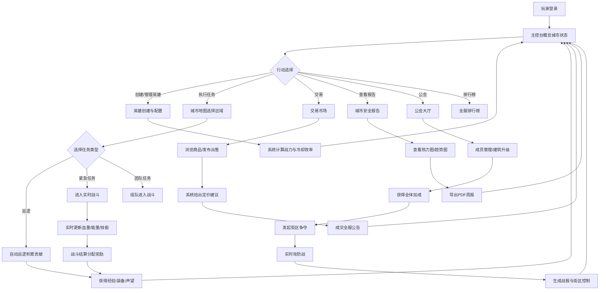

## 1. 产品概述

超级英雄城市保卫与联盟对抗系统是一款多人在线策略角色扮演Web应用。玩家创建专属超级英雄，守护城市安全，组建公会争夺街区控制权，体验实时战斗、交易与协作的完整英雄生态。

- 核心价值：打造沉浸式超级英雄养成与城市管理体验，融合RPG成长、实时策略、社交交易和公会对抗
- 目标用户：超级英雄题材爱好者、策略游戏玩家、MMO社交用户

---

## 2. 核心功能

### 2.1 用户角色

| 角色 | 核心权限 |
|------|----------|
| 普通玩家 | 创建英雄、执行任务、交易物品、加入公会、查看排行榜 |
| 公会会长 | 审批成员、发起晋升、升级公会建筑、宣战街区争夺 |
| 公会副会长 | 协助审批成员、管理公会日常、组织活动 |

### 2.2 功能模块

1. **主控台/仪表盘**：城市全局概览、英雄状态、快捷入口
2. **英雄创建与管理**：英雄创建、超能力搭配、战衣武器配置、战力计算
3. **城市地图系统**：三大区域实时状态、随机事件触发、巡逻与任务接取
4. **实时战斗系统**：任务执行、血量能量管理、技能冷却、团队配合评分
5. **战后结算系统**：经验分配、装备掉落、声望获取
6. **交易市场**：战衣蓝图/技能书交易、智能定价建议、全服成交公告
7. **城市安全报告**：犯罪率热力图、活跃度曲线、满意度趋势、PDF导出
8. **全服排行榜**：战力排名、任务完成率、城市贡献度、英雄详情查看
9. **公会系统**：成员管理、职位晋升、建筑升级、属性加成
10. **街区争夺战**：公会宣战、实时攻防、战报统计、街区控制

### 2.3 页面详情

| 页面名称 | 模块名称 | 功能描述 |
|----------|----------|----------|
| 主控台 | 城市概览 | 三大区域状态卡片、犯罪率仪表盘、资源产出统计 |
| 主控台 | 英雄状态 | 血量/能量条、核心技能冷却、活跃任务进度 |
| 主控台 | 实时动态 | 随机事件滚动、全服公告、最新成交提示 |
| 英雄创建 | 基础信息 | 英雄名称、称号、阵营选择 |
| 英雄创建 | 超能力选择 | 飞行/力量/速度/心灵/能量等5+超能力，可组合搭配 |
| 英雄创建 | 战衣配置 | 战衣样式选择、属性加成预览 |
| 英雄创建 | 武器装备 | 主副武器选择、品质分级 |
| 英雄创建 | 战力分析 | 综合战力实时计算、技能冷却效率评估 |
| 城市地图 | 区域视图 | 金融区/工业区/住宅区三大板块可视化 |
| 城市地图 | 区域详情 | 犯罪率、市民满意度、资源产出数值 |
| 城市地图 | 事件系统 | 随机事件触发（银行劫案、外星入侵等） |
| 城市地图 | 任务接取 | 巡逻任务、紧急任务、团队任务 |
| 战斗界面 | 实时状态 | 动态血条、能量条、技能冷却进度环 |
| 战斗界面 | 技能面板 | 4-6个主动技能、普攻、终极技能 |
| 战斗界面 | 团队信息 | 队友状态、团队配合评分实时更新 |
| 战斗界面 | 战场日志 | 伤害统计、治疗量、击杀记录滚动 |
| 战后结算 | 个人贡献 | 伤害占比、治疗量、救援次数、评分 |
| 战后结算 | 奖励分配 | 经验值、装备掉落、声望、金币 |
| 交易市场 | 商品列表 | 战衣蓝图、技能书、稀有材料分类展示 |
| 交易市场 | 发布商品 | 物品上架、自定义定价、系统建议价格区间 |
| 交易市场 | 我的订单 | 出售中、已售出、购买记录 |
| 安全报告 | 热力图 | 各区域犯罪率热力图可视化 |
| 安全报告 | 趋势图 | 英雄活跃度曲线、市民满意度趋势 |
| 安全报告 | 周报统计 | 本周事件数、任务完成数、资源汇总 |
| 安全报告 | PDF导出 | 一键导出完整周报PDF |
| 排行榜 | 榜单分类 | 战力榜、任务完成率榜、城市贡献度榜 |
| 排行榜 | 英雄详情 | 他人英雄配置查看、战绩历史 |
| 公会大厅 | 成员管理 | 成员列表、职位审批、晋升操作 |
| 公会大厅 | 建筑升级 | 训练室、情报中心升级界面 |
| 公会大厅 | 加成展示 | 全体成员属性加成、任务奖励提升 |
| 街区争夺 | 宣战界面 | 可争夺街区列表、宣战操作 |
| 街区争夺 | 实时攻防 | 双方代表实时对战界面 |
| 街区争夺 | 战报详情 | 个人杀敌、贡献排名、街区控制度变化 |

---

## 3. 核心流程

---

## 4. 用户界面设计

### 4.1 设计风格

- **主色调**：深空蓝 (#0A1628) 为基底，电光蓝 (#00D4FF) 为主强调色，警报红 (#FF3D5A) 为警示色，能量金 (#FFC93C) 为成就色
- **次色调**：霓虹紫 (#A855F7)、辐射绿 (#22C55E)、科技灰 (#64748B)
- **按钮风格**：微立体圆角按钮，悬停发光效果，按下微缩反馈；紧急操作为霓虹边框脉冲效果
- **字体方案**：标题使用 Orbitron（科幻等宽字体），正文使用 Rajdhani（现代硬朗无衬线），数据展示使用 JetBrains Mono
- **布局风格**：卡片式模块布局，斜切边角营造科技感，深色玻璃拟态 (Glassmorphism) 叠加霓虹边缘光
- **图标风格**：线性+填充混合图标，发光描边效果，使用 heroicons 基础上自定义超能力主题图标

### 4.2 页面设计概览

| 页面名称 | 模块名称 | UI元素与动效 |
|----------|----------|--------------|
| 主控台 | 城市概览 | 大尺寸数据卡片，犯罪率环形进度条带发光效果，数值变化时数字滚动动画 |
| 主控台 | 英雄状态 | 血条能量条渐变填充，低血量红色脉冲警示，技能冷却环形倒计时 |
| 英雄创建 | 战力分析 | 雷达图六维展示，实时更新带动画，战力数值发光脉冲 |
| 城市地图 | 区域视图 | 区域卡片悬浮发光，事件触发时边框闪烁红光，点击展开时缩放过渡 |
| 战斗界面 | 技能面板 | 技能图标冷却遮罩旋转动画，释放时冲击波粒子效果 |
| 交易市场 | 定价建议 | 建议区间用渐变条可视化，超出区间价格标红/标绿警示 |
| 安全报告 | 热力图 | 颜色深浅动态映射犯罪率，hover显示详情tooltip，过渡动画平滑 |
| 排行榜 | 排名列表 | 前三名金色/银色/铜色奖章边框，行悬停霓虹边缘光 |
| 街区争夺 | 攻防界面 | 双方血条对置布局，占领进度条实时动画，胜利时全屏粒子特效 |

### 4.3 响应式设计

- 桌面端优先 (1440px+)，采用三栏布局
- 平板端 (1024px) 自适应为双栏，侧边栏可折叠
- 移动端 (768px) 单栏堆叠，底部Tab导航，关键数据优先展示
- 战斗界面专门优化：移动端技能按钮放大，支持触控手势释放技能

---
