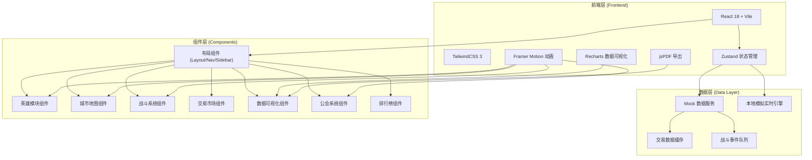
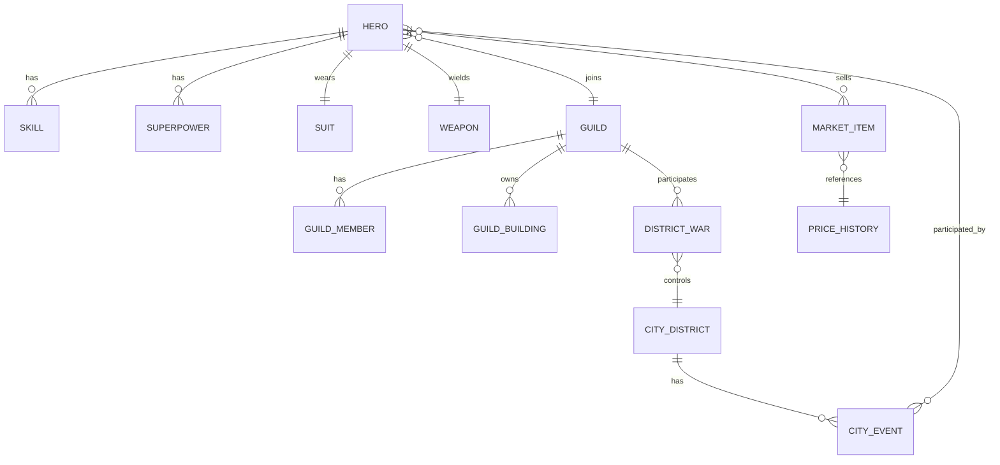

## 1. 架构设计



## 2. 技术选型说明

- **前端框架**: React 18 + TypeScript —— 类型安全，组件化开发，生态成熟
- **构建工具**: Vite 5 —— 极速热更新，构建性能优异
- **样式方案**: TailwindCSS 3 —— 原子化CSS，快速构建定制UI
- **状态管理**: Zustand —— 轻量无依赖，适合复杂游戏状态管理
- **数据可视化**: Recharts —— React原生图表库，支持热力图/折线图/雷达图
- **动画方案**: Framer Motion —— 声明式动画，流畅过渡效果
- **PDF导出**: jsPDF + html2canvas —— 前端生成周报PDF
- **图标方案**: @heroicons/react —— 高质量线性/填充图标

## 3. 路由定义

| 路由 | 页面名称 | 用途 |
|------|----------|------|
| / | 主控台 | 城市概览、英雄状态、实时动态 |
| /hero/create | 英雄创建 | 创建新英雄、配置超能力/战衣/武器 |
| /hero/manage | 英雄管理 | 查看/编辑已有英雄配置 |
| /city | 城市地图 | 三大区域状态、随机事件、任务接取 |
| /battle | 实时战斗 | 任务执行、技能释放、团队配合 |
| /battle/result | 战后结算 | 贡献统计、奖励分配 |
| /market | 交易市场 | 商品浏览、发布出售、订单管理 |
| /report | 安全报告 | 热力图、趋势图、周报、PDF导出 |
| /rankings | 排行榜 | 战力/任务率/贡献度排名 |
| /guild | 公会大厅 | 成员管理、建筑升级、街区争夺 |

## 4. 核心数据类型定义

```typescript
// 英雄相关
interface SuperPower {
  id: string;
  name: string;
  icon: string;
  description: string;
  attack: number;
  defense: number;
  speed: number;
  cooldownModifier: number;
}

interface Suit {
  id: string;
  name: string;
  rarity: 'common' | 'rare' | 'epic' | 'legendary';
  defense: number;
  energyBonus: number;
  healthBonus: number;
  color: string;
}

interface Weapon {
  id: string;
  name: string;
  type: 'melee' | 'ranged' | 'energy';
  rarity: 'common' | 'rare' | 'epic' | 'legendary';
  damage: number;
  attackSpeed: number;
  criticalChance: number;
}

interface Hero {
  id: string;
  name: string;
  title: string;
  faction: 'justice' | 'neutral' | 'chaos';
  level: number;
  exp: number;
  powers: SuperPower[];
  suit: Suit;
  weapon: Weapon;
  health: number;
  maxHealth: number;
  energy: number;
  maxEnergy: number;
  combatPower: number;
  cooldownEfficiency: number;
  reputation: number;
  gold: number;
  skills: Skill[];
}

interface Skill {
  id: string;
  name: string;
  description: string;
  damage: number;
  energyCost: number;
  cooldown: number;
  currentCooldown: number;
  type: 'active' | 'ultimate' | 'passive';
}

// 城市区域相关
interface CityDistrict {
  id: 'finance' | 'industry' | 'residential';
  name: string;
  description: string;
  crimeRate: number;
  citizenSatisfaction: number;
  resourceOutput: number;
  activeEvents: CityEvent[];
  controllingGuild?: string;
}

interface CityEvent {
  id: string;
  type: 'bank_robbery' | 'alien_invasion' | 'fire' | 'gang_war' | 'hostage';
  name: string;
  description: string;
  severity: 1 | 2 | 3 | 4 | 5;
  districtId: string;
  reward: { exp: number; gold: number; reputation: number };
  participants: string[];
  status: 'active' | 'in_progress' | 'completed';
}

// 战斗相关
interface BattleState {
  id: string;
  heroId: string;
  teammates: Hero[];
  enemies: Enemy[];
  logs: BattleLog[];
  teamworkScore: number;
  startTime: number;
  status: 'fighting' | 'victory' | 'defeat';
}

interface Enemy {
  id: string;
  name: string;
  health: number;
  maxHealth: number;
  damage: number;
  type: string;
}

interface BattleLog {
  timestamp: number;
  type: 'damage' | 'heal' | 'skill' | 'kill' | 'info';
  message: string;
  value?: number;
}

// 交易相关
interface MarketItem {
  id: string;
  sellerId: string;
  sellerName: string;
  itemType: 'blueprint' | 'skill_book' | 'material';
  itemName: string;
  itemRarity: string;
  price: number;
  suggestedPriceMin: number;
  suggestedPriceMax: number;
  listedAt: number;
  status: 'listed' | 'sold' | 'expired';
}

interface PriceHistory {
  itemType: string;
  averagePrice: number;
  priceHistory: { date: string; price: number }[];
}

// 报告相关
interface WeeklyReport {
  weekStart: string;
  weekEnd: string;
  districtStats: {
    districtId: string;
    crimeRateData: number[];
    satisfactionData: number[];
  }[];
  heroActivity: { date: string; activeHeroes: number }[];
  totalEvents: number;
  totalMissions: number;
  totalResources: number;
}

// 排行榜相关
interface RankingEntry {
  rank: number;
  heroId: string;
  heroName: string;
  heroTitle: string;
  value: number;
  change: 'up' | 'down' | 'same';
}

// 公会相关
interface Guild {
  id: string;
  name: string;
  level: number;
  presidentId: string;
  vicePresidentIds: string[];
  members: GuildMember[];
  buildings: GuildBuilding[];
  controlledDistricts: string[];
  totalPower: number;
}

interface GuildMember {
  heroId: string;
  heroName: string;
  role: 'president' | 'vice' | 'officer' | 'member';
  joinDate: number;
  contribution: number;
}

interface GuildBuilding {
  id: string;
  name: string;
  level: number;
  maxLevel: number;
  effect: string;
  bonus: { stat: string; value: number };
  upgradeCost: number;
}

interface DistrictWar {
  id: string;
  districtId: string;
  attackerGuildId: string;
  defenderGuildId: string;
  attackerPower: number;
  defenderPower: number;
  attackerControl: number;
  defenderControl: number;
  participants: WarParticipant[];
  status: 'preparing' | 'fighting' | 'ended';
  winner?: string;
}

interface WarParticipant {
  heroId: string;
  heroName: string;
  guildId: string;
  kills: number;
  damage: number;
  contribution: number;
}
```

## 5. 数据模型ER图



## 6. 目录结构

```
src/
├── assets/              # 静态资源（字体、图片、图标）
├── components/
│   ├── layout/          # 布局组件（Header, Sidebar, Footer）
│   ├── hero/            # 英雄相关组件
│   ├── city/            # 城市地图组件
│   ├── battle/          # 战斗系统组件
│   ├── market/          # 交易市场组件
│   ├── report/          # 数据报告组件
│   ├── ranking/         # 排行榜组件
│   ├── guild/           # 公会系统组件
│   └── ui/              # 通用UI组件（Card, Button, Progress等）
├── data/                # Mock数据
│   ├── heroes.ts
│   ├── city.ts
│   ├── market.ts
│   ├── guild.ts
│   └── rankings.ts
├── hooks/               # 自定义Hooks
│   ├── useHero.ts
│   ├── useBattle.ts
│   ├── useCity.ts
│   └── useMarket.ts
├── pages/               # 页面组件
│   ├── Dashboard.tsx
│   ├── HeroCreate.tsx
│   ├── HeroManage.tsx
│   ├── CityMap.tsx
│   ├── Battle.tsx
│   ├── BattleResult.tsx
│   ├── Market.tsx
│   ├── Report.tsx
│   ├── Rankings.tsx
│   └── Guild.tsx
├── store/               # Zustand状态管理
│   ├── useHeroStore.ts
│   ├── useCityStore.ts
│   ├── useBattleStore.ts
│   ├── useMarketStore.ts
│   └── useGuildStore.ts
├── types/               # TypeScript类型定义
│   └── index.ts
├── utils/               # 工具函数
│   ├── combat.ts        # 战力计算
│   ├── format.ts        # 格式化工具
│   └── pdf.ts           # PDF导出
├── App.tsx
├── main.tsx
└── index.css
```
